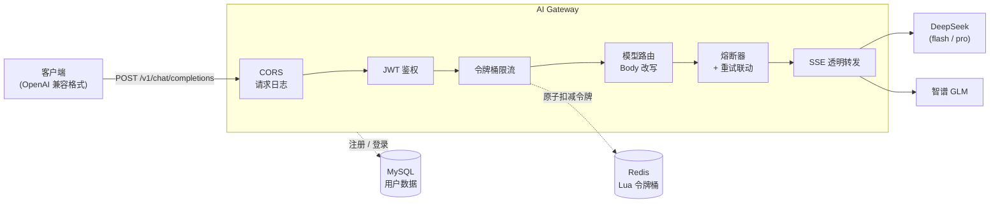

# AI Gateway

基于 Go 的轻量级 AI API 网关 —— 统一接入多家大模型,提供鉴权、限流、模型路由与熔断保护,客户端以 OpenAI 兼容格式零改造接入。


## 项目简介

业务系统直连大模型 API 会遇到一系列问题:各家接口格式不一、密钥散落在各处、没有统一的限流和用量管控、上游故障时雪崩传导到业务层。

AI Gateway 在业务层与大模型之间加了一层统一代理:所有 LLM 请求经过网关完成 **鉴权 → 限流 → 路由 → 熔断保护 → 流式转发**,业务方只需面向一个 OpenAI 兼容接口编程,无需关心背后是 DeepSeek 还是 GLM。

## 架构设计



一次对话请求的完整生命周期:客户端携带 JWT 调用 `/v1/chat/completions` → 鉴权中间件校验 Token 并解析用户身份 → 限流中间件按用户维度在 Redis 中原子扣减令牌 → 路由器根据请求体中的 `model` 字段找到上游配置,改写为上游真实模型名 → 熔断器放行后转发请求(失败自动重试,连续失败触发熔断) → 上游的 SSE 流式响应逐块透传回客户端,不做缓冲。

## 核心功能

| 功能 | 实现要点 |
|------|---------|
| OpenAI 兼容接入 | 统一暴露 `/v1/chat/completions`,客户端用任意 OpenAI SDK 零改造切换 |
| SSE 流式转发 | 基于 `http.Flusher` 逐块透传,不缓冲完整响应,首 Token 延迟无损 |
| JWT 鉴权 | HS256 签名,`KeyFunc` 中校验签名算法防替换攻击,密码 bcrypt 哈希存储 |
| 分布式限流 | Redis + Lua 实现令牌桶,按用户维度限流,脚本原子执行,多实例计数一致 |
| 多模型路由 | 用户指定网关模型名,网关改写请求体映射到上游真实模型,屏蔽内部命名 |
| 熔断保护 | 每个上游独立的三态状态机(Closed / Open / HalfOpen),与重试联动,快速失败 |
| 健康可观测 | `GET /models` 实时暴露各上游熔断状态;Zap 结构化日志覆盖全调用链路 |
| 云原生部署 | Docker 多阶段构建(镜像约 20MB),附 k8s 部署清单(HPA / 探针 / Secret 注入) |

## 技术亮点与设计决策

### 1. 限流为什么用 Redis + Lua,而不是 Go 内存令牌桶

内存版令牌桶(如 `golang.org/x/time/rate`)只对单进程生效,而网关在 k8s 中以多副本运行且会被 HPA 扩缩容——每个副本各限各的,全局限流就名存实亡。把桶状态放进 Redis 后,所有副本共享同一份计数。

读取令牌数、按时间差补充、判断、扣减是四步操作,分开执行会有并发竞态(两个请求同时读到"还剩 1 个令牌"然后都放行)。封装进一段 Lua 脚本后,Redis 单线程原子执行,天然无竞态。补充令牌采用**惰性计算**:不开后台定时器,每次请求时按 `(now - last_time) × rate` 现算应补多少,一万个用户也只是一万个 Redis Hash,没有一万个 goroutine。

### 2. 熔断为什么选择"快速失败",而不是静默切换备用模型

上游连续失败达到阈值后,熔断器进入 Open 状态直接拒绝请求,网关向用户返回 `503` 并提示切换其他模型——而不是悄悄把请求转给备用模型。

这是一个刻意的取舍:不同模型在**成本、能力、响应风格**上差异很大,用户明确指定了 `deepseek-pro`,静默换成 `glm` 可能返回质量完全不同的结果,还按不同价格计费,这种"惊喜"比失败更糟糕。快速失败把选择权交还调用方,配合 `GET /models` 暴露的实时熔断状态,调用方可以自行决策降级策略。自动切换将作为显式的 `auto` 路由模式在后续版本提供——用户主动选择"我不在乎用哪个模型"时,网关才有权替他做决定。

熔断器与重试是联动的:转发循环以 `cb.Allow()` 为放行条件,单次失败(连接错误或上游 5xx)上报熔断器并间隔重试,连续失败达到阈值后状态机翻转为 Open,循环自然终止。超时后进入 HalfOpen 放行试探请求,成功则恢复 Closed,失败则重新熔断。

### 3. SSE 流式转发为什么不能缓冲

大模型的核心体验指标是**首 Token 延迟**。如果网关把上游响应读完再返回,用户要白等十几秒才能看到第一个字,流式输出的意义就没了。

实现上,从上游 `resp.Body` 按 4KB 块循环读取,每读到一块立刻写入客户端并调用 `http.Flusher.Flush()` 强制刷出缓冲区,做到上游产出一个 chunk、客户端就收到一个 chunk。网关在中间近似零延迟,只透传不解析。

### 4. 两个容易被忽略的安全细节

**JWT 算法替换攻击防御**:`jwt.ParseWithClaims` 的 `KeyFunc` 中显式校验 `token.Method` 必须是 HMAC 家族。如果省略这一步,攻击者可以把 Token 头部的 `alg` 字段改成其他算法诱导校验逻辑错乱——这是 JWT 库使用中最经典的漏洞模式。

**防用户名枚举**:登录时"用户不存在"和"密码错误"返回完全相同的 `401 invalid username or password`。如果两种情况返回不同信息,攻击者可以批量探测哪些用户名已注册,为撞库攻击提供名单。具体失败原因只记录在服务端日志中。

### 5. 密钥管理:配置不进镜像

上游 API Key 支持两种注入方式:本地开发在 `config.yaml` 中直接填 `api_key`;容器化部署填 `api_key_env` 指定环境变量名,启动时从环境变量读取覆盖(k8s 场景由 Secret 注入)。配合 `.dockerignore` 排除真实配置文件,保证密钥永远不会被打进镜像层——镜像可以随意分发,密钥跟着运行环境走。

## 快速开始

### 本地开发

```bash
# 1. 启动依赖(MySQL 8.0 + Redis 7)
docker compose up -d

# 2. 准备配置,填入你的上游 API Key
cp configs/config.example.yaml configs/config.yaml

# 3. 启动网关
go run ./cmd/gateway
```

验证:

```bash
# 注册并登录拿 Token
curl -X POST http://localhost:8080/register -d '{"username":"test","password":"123456"}'
curl -X POST http://localhost:8080/login    -d '{"username":"test","password":"123456"}'

# 发起对话(流式)
curl -N http://localhost:8080/v1/chat/completions \
  -H "Authorization: Bearer <你的token>" \
  -H "Content-Type: application/json" \
  -d '{"model":"deepseek-flash","stream":true,"messages":[{"role":"user","content":"你好"}]}'
```

也可以直接在浏览器打开 `test/index.html`,内置模型选择、多轮对话和上游健康状态面板。

### Docker 部署

```bash
docker build -t ai-gateway:latest .
docker run -d -p 8080:8080 \
  -v $(pwd)/configs:/app/configs \
  ai-gateway:latest
```

> 注意:容器内访问宿主机的 MySQL / Redis 时,配置中的 `localhost` 需改为宿主机可达地址(如 `host.docker.internal`),或使用 `--network host`。

### Kubernetes 部署

```bash
# 1. 按 k8s/secret.example.yaml 填好 API Key 等敏感信息
# 2. 应用全部清单
kubectl apply -f k8s/
```

部署清单包含 Deployment(双副本 + 存活/就绪探针)、Service、ConfigMap(挂载配置文件)、Secret(注入密钥)、HPA(按 CPU 自动扩缩容)与 Ingress。

## API 一览

| 方法 | 路径 | 鉴权 | 说明 |
|------|------|:----:|------|
| POST | `/register` | - | 用户注册 |
| POST | `/login` | - | 登录,返回 JWT(24h 有效) |
| POST | `/v1/chat/completions` | ✅ | 对话接口,OpenAI 兼容,支持 `stream` |
| GET | `/models` | - | 各上游模型实时熔断状态 |
| GET | `/health` | - | 存活探针 |

## 项目结构

```
.
├── cmd/gateway/          # 程序入口:依赖初始化(main.go) + 路由注册(router.go)
├── internal/
│   ├── auth/             # JWT 生成与解析
│   ├── breaker/          # 熔断器三态状态机
│   ├── config/           # Viper 配置加载,环境变量注入
│   ├── db/               # MySQL / Redis 连接与迁移
│   ├── logger/           # Zap 日志初始化
│   ├── middleware/       # 鉴权、限流、请求日志中间件
│   ├── proxy/            # 请求转发:Body 改写、重试、SSE 流式透传
│   ├── ratelimit/        # Redis + Lua 令牌桶
│   ├── router/           # 模型名 → 上游配置/熔断器 的路由表
│   └── user/             # 用户注册登录(bcrypt + GORM)
├── configs/              # 配置文件(config.example.yaml 为模板)
├── k8s/                  # Kubernetes 部署清单
├── scripts/              # 数据库初始化脚本
├── test/                 # 浏览器测试页(模型选择 / 多轮对话 / 健康面板)
├── docker-compose.yml    # 本地依赖:MySQL + Redis
└── Dockerfile            # 多阶段构建
```

包按能力组织(auth / ratelimit / breaker...),接口定义在使用方而非实现方,依赖全部通过构造函数注入,无全局变量(日志的 `zap.ReplaceGlobals` 为唯一刻意例外)。

## Roadmap

- [ ] **Token 计费**:记录每次调用的模型、Token 用量、耗时与费用,落库 MySQL
- [ ] **语义缓存**:相似请求命中 Redis 缓存,降低上游调用成本
- [ ] **用户自定义模型**:支持用户注册自己的上游模型与密钥,动态路由
- [ ] **Auto 智能路由**:用户选择 `auto` 模式时,网关按成本/延迟/可用性自动选择上游
- [ ] **演示前端**:更完整的对话界面

## License

MIT
